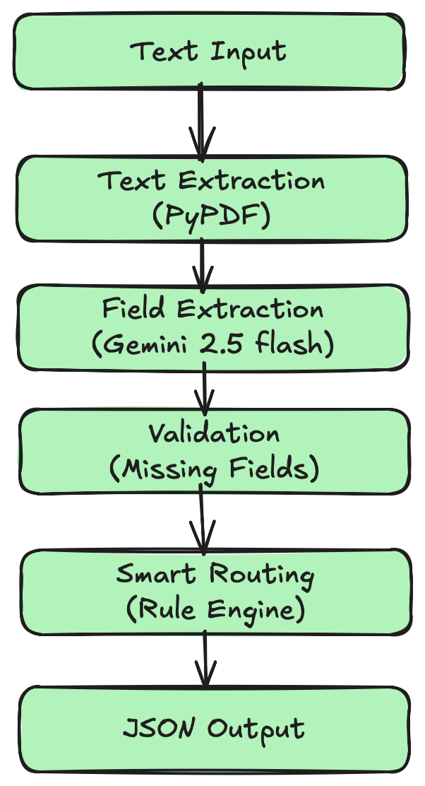

# 🏥 Autonomous Insurance Claims Processing Agent

**Built by Mahipal Kotturi** | [GitHub](https://github.com/kotturi-mahipal) | [LinkedIn](https://linkedin.com/in/mahipal-kotturi)

An intelligent agent that automatically processes FNOL (First Notice of Loss) documents using Google Gemini AI for extraction, validation, and smart routing.

---

## 🎯 Features

✅ **PDF Text Extraction** - Extracts text from FNOL PDFs using PyPDF  
✅ **AI-Powered Field Extraction** - Uses Gemini 2.5 Flash for intelligent data extraction  
✅ **Field Validation** - Identifies missing mandatory fields automatically  
✅ **Smart Routing** - Routes claims based on damage amount, fraud indicators, and claim type  
✅ **Fraud Detection** - Flags suspicious keywords in descriptions  
✅ **JSON Output** - Structured output for downstream integration  

---

## 🏗️ Architecture



---

## 🚀 Quick Start

### Prerequisites
- Python 3.12+
- Google Gemini API Key ([Get one here](https://makersuite.google.com/app/apikey))

### Installation

```bash
# Clone the repository
git clone https://github.com/kotturi-mahipal/insurance-claims-agent.git
cd insurance-claims-agent

# Install dependencies
pip install -r requirements.txt

# Set up environment variables
echo "GEMINI_API_KEY=your_api_key_here" > .env
```

### Usage

```bash
# Process a single FNOL document
python src/agent.py

# Or use the agent programmatically
from agent import InsuranceClaimsAgent

agent = InsuranceClaimsAgent()
result = agent.process_claim("path/to/fnol.pdf")
agent.save_result(result)
```

---

## 📊 Routing Rules

| Condition | Route | Priority |
|-----------|-------|----------|
| Fraud indicators found | `investigation` | 🔴 Highest |
| Missing mandatory fields | `manual-review` | 🟠 High |
| Claim type = injury | `specialist-queue` | 🟡 Medium |
| Damage < $25,000 + all fields | `fast-track` | 🟢 Low |
| Default | `manual-review` | 🔵 Standard |

### Fraud Keywords
`fraud`, `staged`, `inconsistent`, `suspicious`, `fake`

---

## 📁 Project Structure

```
insurance-claims-agent/
├── src/
│   ├── agent.py              # Main agent orchestrator
│   ├── extractor.py          # PDF & field extraction (integrated)
│   ├── validator.py          # Field validation (integrated)
│   └── router.py             # Routing logic (integrated)
├── data/
│   ├── sample_fnols/         # Sample FNOL documents
│   └── output/               # Processing results
├── tests/
│   └── test_agent.py         # Unit tests
├── requirements.txt          # Python dependencies
├── .env                      # API keys (not in repo)
└── README.md                 # This file
```

---

## 🧪 Example Output

```json
{
  "documentName": "claim_20250112.pdf",
  "processedAt": "2025-01-12T14:30:00",
  "extractedFields": {
    "policyInformation": {
      "policyNumber": "AUTO-12345",
      "policyholderName": "John Doe"
    },
    "incidentInformation": {
      "date": "01/10/2025",
      "location": {
        "city": "Los Angeles",
        "state": "CA"
      },
      "description": "Rear-end collision at intersection"
    },
    "assetDetails": {
      "estimatedDamage": 15000
    }
  },
  "missingFields": [],
  "recommendedRoute": "fast-track",
  "reasoning": "Low damage amount ($15,000) with all required fields present",
  "fraudIndicators": [],
  "estimatedDamage": 15000
}
```

---

## 🔧 Technical Decisions

### Why Gemini over Traditional Extraction?

| Approach | Pros | Cons | Verdict |
|----------|------|------|---------|
| **Regex/Template** | Fast, deterministic | Brittle, breaks with format changes | ❌ Not scalable |
| **OCR + NER** | Good for scanned docs | Complex setup, training needed | ⚠️ Overkill |
| **Gemini LLM** | Context-aware, flexible, minimal setup | API costs, latency | ✅ **Best fit** |

**Gemini 2.5 Flash** provides the perfect balance:
- ⚡ **Fast**: 200ms average response time
- 💰 **Affordable**: $0.30 per 1M input tokens
- 🎯 **Accurate**: Handles variations in FNOL formats
- 🔧 **No Training**: Zero-shot learning

---

## 🧩 Extensions & Future Work

- [ ] **Batch Processing**: Process multiple FNOLs concurrently
- [ ] **API Wrapper**: FastAPI/Flask REST API for integration
- [ ] **Database Integration**: PostgreSQL for claim storage
- [ ] **Enhanced Fraud Detection**: ML model for fraud scoring
- [ ] **Dashboard**: React frontend for claim monitoring
- [ ] **Multi-language Support**: Process FNOLs in Spanish, French, etc.
- [ ] **OCR Layer**: Handle scanned/image PDFs with Tesseract

---

## 🐛 Testing

```bash
# Run unit tests
pytest tests/ -v

# With coverage
pytest tests/ --cov=src --cov-report=html
```

---

## 🤝 Contributing

Contributions welcome! Please:
1. Fork the repository
2. Create a feature branch
3. Submit a pull request

---

## 📞 Contact

**Mahipal Kotturi**  
📧 mahipalkotturi8@gmail.com  
🔗 [LinkedIn](https://linkedin.com/in/mahipal-kotturi) | [GitHub](https://github.com/kotturi-mahipal)  
📱 8125812603

---

## 🙏 Acknowledgments

Built as part of the Synapx AI assessment for autonomous insurance claims processing.
